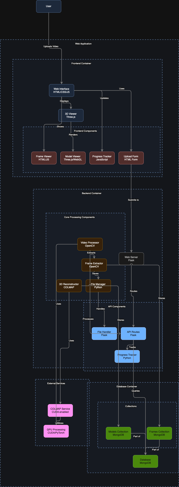

<div align="center">

#  TFGDBA Video to 3D Model 

### *Transform Videos into Stunning 3D Models*


[](https://github.com/gilito21/TFGDBA/commits)
[](https://hub.docker.com/r/tiogilito21/tfgdba-app)
[](LICENSE)

</div>

<div align="center">

[](https://expressjs.com/)
[](https://flask.palletsprojects.com/)
[](https://developer.mozilla.org/en-US/docs/Web/JavaScript)
[](https://www.typescriptlang.org/)
[](https://www.npmjs.com/)
[](https://gunicorn.org/)
[](https://www.mongodb.com/)
[](https://numpy.org/)
[](https://www.python.org/)
[](https://threejs.org/)

</div>

## 📋 Overview

TFGDBA is a powerful application that transforms ordinary videos into detailed 3D models. Using advanced computer vision algorithms and GPU acceleration, it extracts frames, analyzes spatial information, and generates high-quality 3D representations for a variety of use cases.

<div align="center">
<table>
<tr>
<td width="50%">

</td>
<td width="50%">

</td>
</tr>
</table>
</div>

## ✨ Features

<div align="center">
<table>
<tr>
<td>
<h3>🎮 3D Model Generation</h3>
Convert videos to detailed, manipulable 3D models
</td>
<td>
<h3>📊 Progress Tracking</h3>
Real-time tracking of processing stages
</td>
</tr>
<tr>
<td>
<h3>💾 Database Integration</h3>
MongoDB storage for models and processing data
</td>
<td>
<h3>🐳 Docker Support</h3>
Containerized deployment for consistent environments
</td>
</tr>
<tr>
<td colspan="2" align="center">
<h3>🌐 Flask-Based Web Application</h3>
Intuitive interface for uploading videos and viewing models
</td>
</tr>
</table>
</div>

## 🚀 Installation

### Prerequisites
- GPU-enabled environment (Lambda Cloud recommended)
- Docker and Docker Compose
- SSH access to your server

### Setup Steps

1. **Connect to Lambda Cloud GPU**
   ```bash
   ssh -i your-key.pem ubuntu@new-lambda-ip
   ```

2. **Clone Repository**
   ```bash
   git clone https://github.com/Gilito21/TFGDBA.git
   ```

3. **Navigate to Project Directory**
   ```bash
   cd TFGDBA
   ```

4. **Make Setup Script Executable**
   ```bash
   chmod +x setup-app.sh
   ```

5. **Run Setup Script (Pulls from Docker Hub)**
   ```bash
   ./setup-app.sh
   ```

## 🏗️ Architecture

<div align="center">

</div>

## 💻 Technology Stack

<table>
<tr>
<th>Layer</th>
<th>Technologies</th>
</tr>
<tr>
<td>Frontend</td>
<td>
  <ul>
    <li>HTML5 / CSS3 / JavaScript</li>
    <li>Three.js for 3D rendering</li>
    <li>Responsive design</li>
  </ul>
</td>
</tr>
<tr>
<td>Backend</td>
<td>
  <ul>
    <li>Python / Flask</li>
    <li>OpenCV for video processing</li>
    <li>COLMAP for 3D reconstruction</li>
    <li>Lambda Cloud GPU for processing</li>
  </ul>
</td>
</tr>
<tr>
<td>Database</td>
<td>
  <ul>
    <li>MongoDB for model and metadata storage</li>
  </ul>
</td>
</tr>
<tr>
<td>Deployment</td>
<td>
  <ul>
    <li>Docker containers</li>
    <li>Docker Compose for orchestration</li>
  </ul>
</td>
</tr>
</table>

## 📄 License

This project is licensed under the MIT License - see the [LICENSE](LICENSE) file for details.

## 👥 Contributors

<div align="center">
<a href="https://github.com/gilito21/TFGDBA/graphs/contributors">
  
</a>
</div>

<div align="center">

## 🌟 Star History

[](https://star-history.com/#gilito21/TFGDBA&Date)

</div>

---

<div align="center">
</div>
